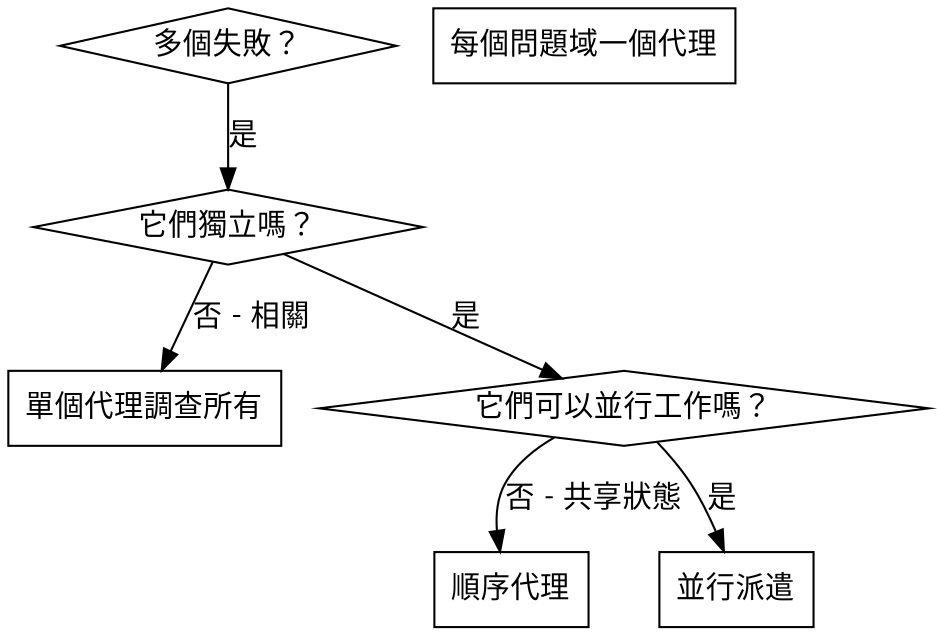

# 派遣並行代理

## 概述

當您有多個無關的失敗（不同的測試文件、不同的子系統、不同的 bug）時，順序調查它們會浪費時間。每個調查都是獨立的，可以並行進行。

**核心原則：** 為每個獨立問題域派遣一個代理。讓它們並發工作。

## 何時使用



**使用時：**
- 3 個以上測試文件因不同根本原因失敗
- 多個子系統獨立損壞
- 每個問題可以在不需要其他背景的情況下理解
- 調查之間沒有共享狀態

**不使用時：**
- 失敗相關（修復一個可能修復其他）
- 需要理解完整系統狀態
- 代理會互相干擾

## 模式

### 1. 識別獨立域

按損壞內容分組失敗：
- 文件 A 測試：工具批准流程
- 文件 B 測試：批次完成行為
- 文件 C 測試：中止功能

每個域都是獨立的 - 修復工具批准不影響中止測試。

### 2. 創建專注的代理任務

每個代理獲得：
- **特定範圍：** 一個測試文件或子系統
- **明確目標：** 使這些測試通過
- **約束：** 不要更改其他代碼
- **預期輸出：** 您發現和修復內容的摘要

### 3. 並行派遣

```typescript
// 在 Claude Code / AI 環境中
Task("修復 agent-tool-abort.test.ts 失敗")
Task("修復 batch-completion-behavior.test.ts 失敗")
Task("修復 tool-approval-race-conditions.test.ts 失敗")
// 全部三個並發運行
```

### 4. 審查和整合

代理返回時：
- 閱讀每個摘要
- 驗證修復不衝突
- 運行完整測試套件
- 整合所有更改

## 代理提示結構

良好的代理提示：
1. **專注** - 一個清晰的問題域
2. **自包含** - 理解問題所需的所有背景
3. **具體說明輸出** - 代理應該返回什麼？

```markdown
修復 src/agents/agent-tool-abort.test.ts 中的 3 個失敗測試：

1. "should abort tool with partial output capture" - 預期訊息中有 'interrupted at'
2. "should handle mixed completed and aborted tools" - 快速工具被中止而非完成
3. "should properly track pendingToolCount" - 預期 3 個結果但得到 0

這些是時序/競爭條件問題。您的任務：

1. 閱讀測試文件並理解每個測試驗證什麼
2. 識別根本原因 - 時序問題還是實際 bug？
3. 通過以下方式修復：
   - 用基於事件的等待替換任意超時
   - 如果發現，修復中止實作中的 bug
   - 如果測試更改的行為，調整測試預期

不要只是增加超時 - 找到真正的問題。

返回：您發現的內容和修復內容的摘要。
```

## 常見錯誤

**❌ 太廣泛：** 「修復所有測試」 - 代理迷失
**✅ 具體：** 「修復 agent-tool-abort.test.ts」 - 專注範圍

**❌ 無背景：** 「修復競爭條件」 - 代理不知道在哪裡
**✅ 背景：** 粘貼錯誤訊息和測試名稱

**❌ 無約束：** 代理可能重構所有東西
**✅ 約束：** 「不要更改生產代碼」或「僅修復測試」

**❌ 模糊輸出：** 「修復它」 - 您不知道更改了什麼
**✅ 具體：** 「返回根本原因和更改的摘要」

## 何時不使用

**相關失敗：** 修復一個可能修復其他 - 先一起調查
**需要完整背景：** 理解需要看到整個系統
**探索性除錯：** 您還不知道什麼壞了
**共享狀態：** 代理會干擾（編輯相同文件，使用相同資源）

## 會話中的真實範例

**場景：** 主要重構後 3 個文件中有 6 個測試失敗

**失敗：**
- agent-tool-abort.test.ts：3 個失敗（時序問題）
- batch-completion-behavior.test.ts：2 個失敗（工具未執行）
- tool-approval-race-conditions.test.ts：1 個失敗（執行計數 = 0）

**決定：** 獨立域 - 中止邏輯與批次完成分開，與競爭條件分開

**派遣：**
```
代理 1 → 修復 agent-tool-abort.test.ts
代理 2 → 修復 batch-completion-behavior.test.ts
代理 3 → 修復 tool-approval-race-conditions.test.ts
```

**結果：**
- 代理 1：用基於事件的等待替換超時
- 代理 2：修復事件結構 bug（threadId 在錯誤位置）
- 代理 3：添加等待異步工具執行完成

**整合：** 所有修復獨立，無衝突，完整套件全綠

**節省時間：** 並行解決 3 個問題 vs 順序

## 關鍵優勢

1. **並行化** - 多個調查同時進行
2. **專注** - 每個代理有窄範圍，更少背景需要追蹤
3. **獨立性** - 代理不互相干擾
4. **速度** - 1 個問題的時間解決 3 個問題

## 驗證

代理返回後：
1. **審查每個摘要** - 理解更改了什麼
2. **檢查衝突** - 代理是否編輯了相同代碼？
3. **運行完整套件** - 驗證所有修復一起工作
4. **抽查** - 代理可能犯系統性錯誤

## 真實世界影響

來自除錯會話（2025-10-03）：
- 3 個文件中 6 個失敗
- 並行派遣 3 個代理
- 所有調查並發完成
- 所有修復成功整合
- 代理更改之間零衝突
