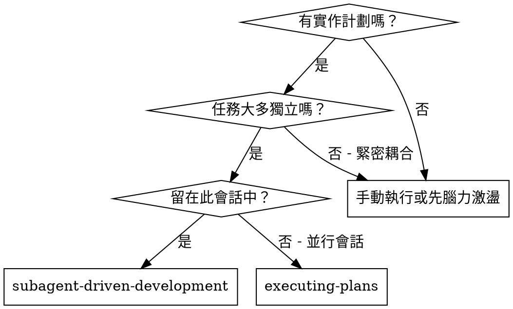
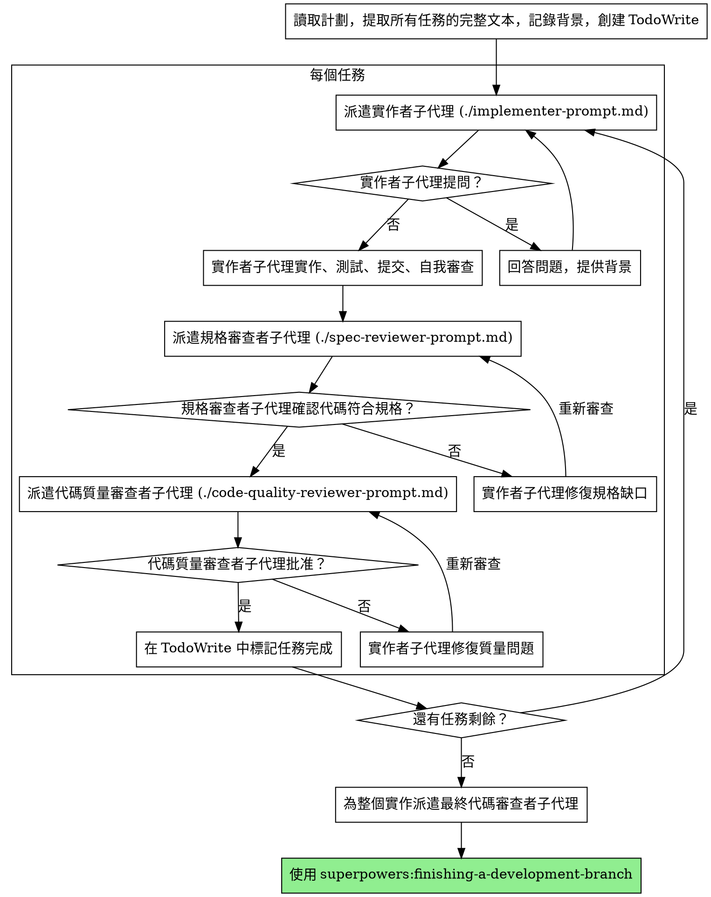

# 子代理驅動開發

通過為每個任務派遣新的子代理來執行計劃，每個任務後進行兩階段審查：首先是規格合規性審查，然後是代碼質量審查。

**核心原則：** 每個任務新的子代理 + 兩階段審查（規格然後質量）= 高質量、快速迭代

## 何時使用



**vs. Executing Plans（並行會話）：**
- 相同會話（無背景切換）
- 每個任務新的子代理（無背景污染）
- 每個任務後兩階段審查：首先規格合規性，然後代碼質量
- 更快的迭代（任務之間無需人工介入）

## 流程



## 提示模板

- `./implementer-prompt.md` - 派遣實作者子代理
- `./spec-reviewer-prompt.md` - 派遣規格合規性審查者子代理
- `./code-quality-reviewer-prompt.md` - 派遣代碼質量審查者子代理

## 工作流程範例

```
您：我正在使用子代理驅動開發執行此計劃。

[讀取計劃文件一次：docs/plans/feature-plan.md]
[提取所有 5 個任務的完整文本和背景]
[使用所有任務創建 TodoWrite]

任務 1：鉤子安裝腳本

[獲取任務 1 文本和背景（已提取）]
[使用完整任務文本 + 背景派遣實作子代理]

實作者：「在開始之前 - 鉤子應該安裝在用戶級還是系統級？」

您：「用戶級（~/.config/superpowers/hooks/）」

實作者：「明白了。現在開始實作...」
[稍後] 實作者：
  - 實作了 install-hook 命令
  - 添加了測試，5/5 通過
  - 自我審查：發現我遺漏了 --force 標誌，已添加
  - 已提交

[派遣規格合規性審查者]
規格審查者：✅ 符合規格 - 滿足所有要求，沒有額外內容

[獲取 git SHA，派遣代碼質量審查者]
代碼審查者：優點：良好的測試覆蓋率，乾淨。問題：無。已批准。

[標記任務 1 完成]

任務 2：恢復模式

[獲取任務 2 文本和背景（已提取）]
[使用完整任務文本 + 背景派遣實作子代理]

實作者：[沒有問題，繼續]
實作者：
  - 添加了驗證/修復模式
  - 8/8 測試通過
  - 自我審查：一切良好
  - 已提交

[派遣規格合規性審查者]
規格審查者：❌ 問題：
  - 缺少：進度報告（規格說「每 100 項報告一次」）
  - 額外：添加了 --json 標誌（未請求）

[實作者修復問題]
實作者：刪除了 --json 標誌，添加了進度報告

[規格審查者再次審查]
規格審查者：✅ 現在符合規格

[派遣代碼質量審查者]
代碼審查者：優點：可靠。問題（重要）：魔術數字（100）

[實作者修復]
實作者：提取了 PROGRESS_INTERVAL 常量

[代碼審查者再次審查]
代碼審查者：✅ 已批准

[標記任務 2 完成]

...

[所有任務之後]
[派遣最終代碼審查者]
最終審查者：滿足所有要求，準備合併

完成！
```

## 優勢

**vs. 手動執行：**
- 子代理自然遵循 TDD
- 每個任務新的背景（無混淆）
- 並行安全（子代理不互相干擾）
- 子代理可以提問（工作之前和期間）

**vs. 執行計劃：**
- 相同會話（無交接）
- 持續進度（無等待）
- 審查檢查點自動化

**效率提升：**
- 無文件讀取開銷（控制器提供完整文本）
- 控制器精確策劃所需背景
- 子代理預先獲得完整信息
- 問題在工作開始前浮現（而非之後）

**質量門檻：**
- 自我審查在交接前捕獲問題
- 兩階段審查：規格合規性，然後代碼質量
- 審查循環確保修復實際有效
- 規格合規性防止過度/不足構建
- 代碼質量確保實作構建良好

**成本：**
- 更多子代理調用（每個任務：實作者 + 2 個審查者）
- 控制器做更多準備工作（預先提取所有任務）
- 審查循環增加迭代
- 但早期捕獲問題（比之後除錯更便宜）

## 紅旗警示

**絕不：**
- 跳過審查（規格合規性或代碼質量）
- 在未修復問題時繼續
- 並行派遣多個實作子代理（衝突）
- 讓子代理讀取計劃文件（改為提供完整文本）
- 跳過場景設置背景（子代理需要理解任務的位置）
- 忽略子代理問題（在讓他們繼續之前回答）
- 在規格合規性上接受「差不多」（規格審查者發現問題 = 未完成）
- 跳過審查循環（審查者發現問題 = 實作者修復 = 再次審查）
- 讓實作者自我審查替代實際審查（兩者都需要）
- **在規格合規性為 ✅ 之前開始代碼質量審查**（錯誤順序）
- 在任一審查有未解決問題時移至下一個任務

**如果子代理提問：**
- 清楚完整地回答
- 如果需要提供額外背景
- 不要催促他們進入實作

**如果審查者發現問題：**
- 實作者（同一子代理）修復它們
- 審查者再次審查
- 重複直到批准
- 不要跳過重新審查

**如果子代理任務失敗：**
- 派遣修復子代理並提供具體指令
- 不要嘗試手動修復（背景污染）

## 整合

**必需的工作流程技能：**
- **superpowers:writing-plans** - 創建此技能執行的計劃
- **superpowers:requesting-code-review** - 審查者子代理的代碼審查模板
- **superpowers:finishing-a-development-branch** - 所有任務後完成開發

**子代理應使用：**
- **superpowers:test-driven-development** - 子代理為每個任務遵循 TDD

**替代工作流程：**
- **superpowers:executing-plans** - 使用並行會話而非相同會話執行
