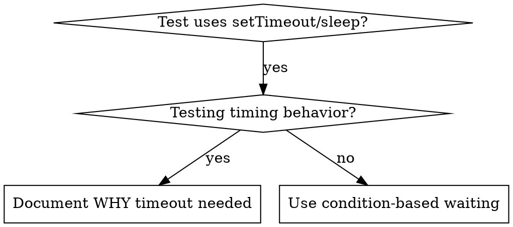

# 基於條件的等待

## 概述

易出錯的測試通常用任意延遲來猜測時序。這會造成競態條件，使得測試在快速機器上通過，但在高負載或 CI 環境中失敗。

**核心原則：** 等待你關心的實際條件,而不是猜測需要多長時間。

## 何時使用



**何時使用:**
- 測試有任意延遲 (`setTimeout`、`sleep`、`time.sleep()`)
- 測試易出錯 (有時通過,高負載時失敗)
- 並行執行測試時超時
- 等待非同步操作完成

**何時不要使用:**
- 測試實際時序行為 (防抖、節流間隔)
- 如果使用任意超時,總是要文檔化為什麼需要

## 核心模式

```typescript
// ❌ 之前: 猜測時序
await new Promise(r => setTimeout(r, 50));
const result = getResult();
expect(result).toBeDefined();

// ✅ 之後: 等待條件
await waitFor(() => getResult() !== undefined);
const result = getResult();
expect(result).toBeDefined();
```

## 快速模式

| 場景 | 模式 |
|----------|---------|
| 等待事件 | `waitFor(() => events.find(e => e.type === 'DONE'))` |
| 等待狀態 | `waitFor(() => machine.state === 'ready')` |
| 等待數量 | `waitFor(() => items.length >= 5)` |
| 等待文件 | `waitFor(() => fs.existsSync(path))` |
| 複雜條件 | `waitFor(() => obj.ready && obj.value > 10)` |

## 實現

通用輪詢函數:
```typescript
async function waitFor<T>(
  condition: () => T | undefined | null | false,
  description: string,
  timeoutMs = 5000
): Promise<T> {
  const startTime = Date.now();

  while (true) {
    const result = condition();
    if (result) return result;

    if (Date.now() - startTime > timeoutMs) {
      throw new Error(`Timeout waiting for ${description} after ${timeoutMs}ms`);
    }

    await new Promise(r => setTimeout(r, 10)); // 每 10ms 輪詢一次
  }
}
```

參考此目錄中的 `condition-based-waiting-example.ts`,了解完整實現,包含來自實際除錯會話的特定領域幫助函數 (`waitForEvent`、`waitForEventCount`、`waitForEventMatch`)。

## 常見錯誤

**❌ 輪詢過快:** `setTimeout(check, 1)` - 浪費 CPU
**✅ 修復:** 每 10ms 輪詢一次

**❌ 無超時:** 如果條件永遠不符合會無限循環
**✅ 修復:** 總是包含超時並提供清晰的錯誤訊息

**❌ 資料過期:** 在循環前快取狀態
**✅ 修復:** 在循環內呼叫取得器以獲得最新資料

## 何時任意超時是正確的

```typescript
// 工具每 100ms 執行一次 - 需要 2 次執行來驗證部分輸出
await waitForEvent(manager, 'TOOL_STARTED'); // 首先: 等待條件
await new Promise(r => setTimeout(r, 200));   // 然後: 等待定時行為
// 200ms = 100ms 間隔的 2 次執行 - 已文檔化並有理由
```

**要求:**
1. 首先等待觸發條件
2. 基於已知時序 (而不是猜測)
3. 說明為什麼的註釋

## 真實影響

來自除錯會話 (2025-10-03):
- 修復了 3 個文件中的 15 個易出錯測試
- 通過率: 60% → 100%
- 執行時間: 快 40%
- 沒有更多競態條件
