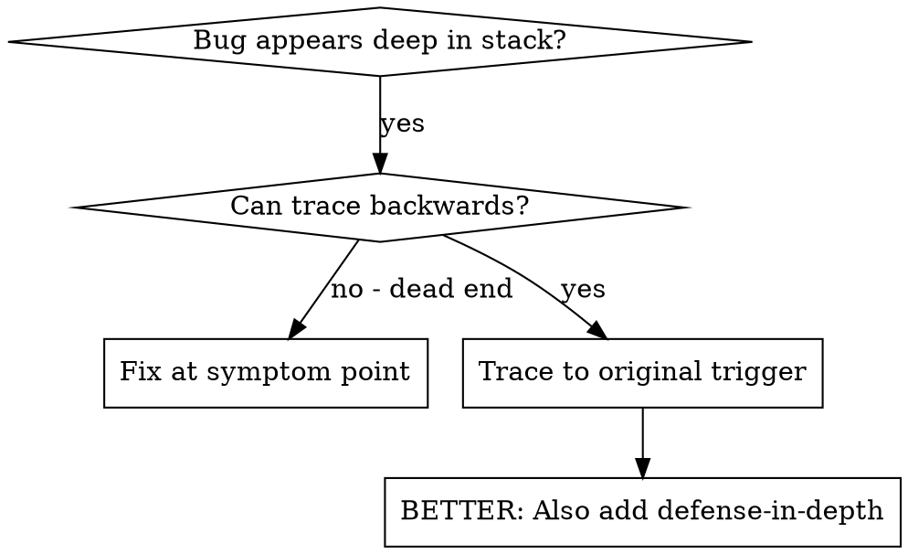
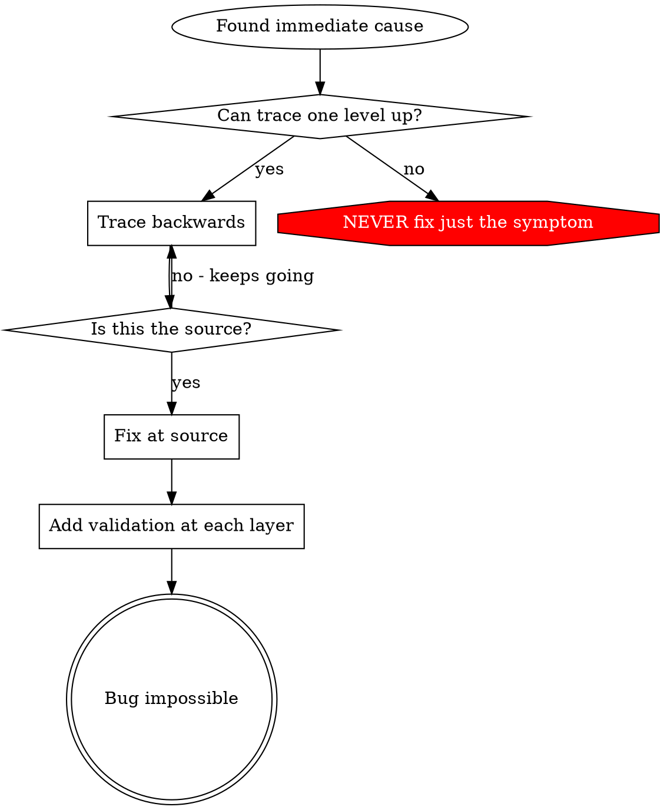

# 根本原因追蹤

## 概述

錯誤通常在深層呼叫棧中表現出來 (在錯誤的目錄中執行 git init、在錯誤的位置創建文件、用錯誤的路徑打開資料庫)。你的直覺是在錯誤出現的地方修復,但那是在處理症狀。

**核心原則：** 通過呼叫鏈向后追蹤,直到找到原始觸發器,然後在源頭修復。

## 何時使用



**何時使用:**
- 錯誤發生在深層執行 (不在入口點)
- 堆棧追蹤顯示長呼叫鏈
- 不清楚無效資料的來源
- 需要找出哪個測試/程式碼觸發了問題

## 追蹤過程

### 1. 觀察症狀
```
Error: git init failed in /Users/jesse/project/packages/core
```

### 2. 找到直接原因
**哪個程式碼直接導致了這個?**
```typescript
await execFileAsync('git', ['init'], { cwd: projectDir });
```

### 3. 問：什麼調用了它?
```typescript
WorktreeManager.createSessionWorktree(projectDir, sessionId)
  → 由 Session.initializeWorkspace() 調用
  → 由 Session.create() 調用
  → 由測試中的 Project.create() 調用
```

### 4. 持續向上追蹤
**傳遞了什麼值?**
- `projectDir = ''` (空字符串!)
- 空字符串作為 `cwd` 解析為 `process.cwd()`
- 那是原始程式碼目錄!

### 5. 找到原始觸發器
**空字符串從哪裡來?**
```typescript
const context = setupCoreTest(); // 返回 { tempDir: '' }
Project.create('name', context.tempDir); // 在 beforeEach 前訪問!
```

## 添加堆棧追蹤

當你無法手動追蹤時,添加檢測:

```typescript
// 在有問題操作前
async function gitInit(directory: string) {
  const stack = new Error().stack;
  console.error('DEBUG git init:', {
    directory,
    cwd: process.cwd(),
    nodeEnv: process.env.NODE_ENV,
    stack,
  });

  await execFileAsync('git', ['init'], { cwd: directory });
}
```

**關鍵:** 在測試中使用 `console.error()` (不是 logger - 可能不會顯示)

**執行並捕捉:**
```bash
npm test 2>&1 | grep 'DEBUG git init'
```

**分析堆棧追蹤:**
- 查找測試文件名
- 找到觸發呼叫的行號
- 確定模式 (同一測試? 同一參數?)

## 找出哪個測試導致污染

如果測試期間出現什麼東西但你不知道是哪個測試:

使用此目錄中的二分法腳本 `find-polluter.sh`:

```bash
./find-polluter.sh '.git' 'src/**/*.test.ts'
```

逐一執行測試,在首個污染者處停止。參考腳本了解用法。

## 真實範例：空 projectDir

**症狀:** `.git` 在 `packages/core/` 中創建 (源程式碼)

**追蹤鏈:**
1. `git init` 在 `process.cwd()` 中執行 ← 空的 cwd 參數
2. WorktreeManager 用空的 projectDir 調用
3. Session.create() 傳遞空字符串
4. 測試在 beforeEach 前訪問 `context.tempDir`
5. setupCoreTest() 最初返回 `{ tempDir: '' }`

**根本原因:** 最頂層變數初始化訪問空值

**修復:** 將 tempDir 改為 getter,在 beforeEach 前訪問時拋出異常

**還添加了深度防禦:**
- 第 1 層: Project.create() 驗證目錄
- 第 2 層: WorkspaceManager 驗證非空
- 第 3 層: NODE_ENV 守衛拒絕在 tmpdir 外執行 git init
- 第 4 層: 在 git init 前的堆棧追蹤日誌

## 關鍵原則



**絕不要只在錯誤出現的地方進行修復。** 向后追蹤以找到原始觸發器。

## 堆棧追蹤提示

**在測試中:** 使用 `console.error()` 而不是 logger - logger 可能被抑制
**在操作前:** 在危險操作前記錄,而不是在失敗後
**包含上下文:** 目錄、cwd、環境變數、時間戳
**捕捉堆棧:** `new Error().stack` 顯示完整呼叫鏈

## 真實影響

來自除錯會話 (2025-10-03):
- 通過 5 級追蹤找到根本原因
- 在源頭修復 (getter 驗證)
- 添加了 4 層防禦
- 1847 個測試通過,零污染
