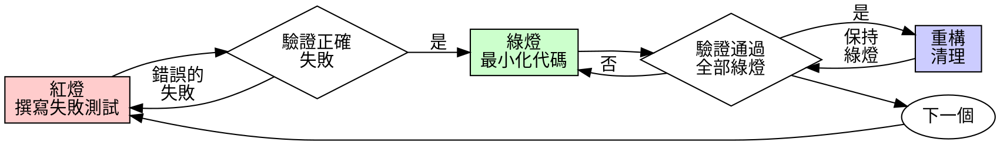

# 測試驅動開發（TDD）

## 概述

先撰寫測試。觀察其失敗。撰寫最小化代碼使其通過。

**核心原則：** 如果您沒有觀察測試失敗，您就不知道它是否測試了正確的東西。

**違反規則的字面意義就是違反規則的精神。**

## 何時使用

**總是：**
- 新功能
- Bug 修復
- 重構
- 行為更改

**例外（詢問您的人類夥伴）：**
- 一次性原型
- 生成的代碼
- 配置文件

想著「這次跳過 TDD」？停止。那是在為自己找理由。

## 鐵律

```
沒有先失敗的測試就不能有生產代碼
```

在測試之前撰寫代碼？刪除它。重新開始。

**無例外：**
- 不要將其保留為「參考」
- 不要在撰寫測試時「調整」它
- 不要看它
- 刪除就是刪除

從測試重新實作。就這樣。

## RED-GREEN-REFACTOR 循環



### 紅燈 - 撰寫失敗的測試

撰寫一個最小化測試來展示應該發生什麼。

<Good>
```typescript
test('retries failed operations 3 times', async () => {
  let attempts = 0;
  const operation = () => {
    attempts++;
    if (attempts < 3) throw new Error('fail');
    return 'success';
  };

  const result = await retryOperation(operation);

  expect(result).toBe('success');
  expect(attempts).toBe(3);
});
```
清晰的名稱，測試真實行為，一件事
</Good>

<Bad>
```typescript
test('retry works', async () => {
  const mock = jest.fn()
    .mockRejectedValueOnce(new Error())
    .mockRejectedValueOnce(new Error())
    .mockResolvedValueOnce('success');
  await retryOperation(mock);
  expect(mock).toHaveBeenCalledTimes(3);
});
```
模糊的名稱，測試模擬而非代碼
</Bad>

**要求：**
- 一個行為
- 清晰的名稱
- 真實代碼（除非無法避免，否則不用模擬）

### 驗證紅燈 - 觀察其失敗

**強制性。絕不跳過。**

```bash
npm test path/to/test.test.ts
```

確認：
- 測試失敗（不是錯誤）
- 失敗訊息符合預期
- 因功能缺失而失敗（不是拼寫錯誤）

**測試通過？** 您在測試現有行為。修復測試。

**測試錯誤？** 修復錯誤，重新運行直到正確失敗。

### 綠燈 - 最小化代碼

撰寫最簡單的代碼使測試通過。

<Good>
```typescript
async function retryOperation<T>(fn: () => Promise<T>): Promise<T> {
  for (let i = 0; i < 3; i++) {
    try {
      return await fn();
    } catch (e) {
      if (i === 2) throw e;
    }
  }
  throw new Error('unreachable');
}
```
剛好足以通過
</Good>

<Bad>
```typescript
async function retryOperation<T>(
  fn: () => Promise<T>,
  options?: {
    maxRetries?: number;
    backoff?: 'linear' | 'exponential';
    onRetry?: (attempt: number) => void;
  }
): Promise<T> {
  // YAGNI
}
```
過度設計
</Bad>

不要添加功能、重構其他代碼或在測試之外「改進」。

### 驗證綠燈 - 觀察其通過

**強制性。**

```bash
npm test path/to/test.test.ts
```

確認：
- 測試通過
- 其他測試仍然通過
- 輸出乾淨（無錯誤、警告）

**測試失敗？** 修復代碼，而非測試。

**其他測試失敗？** 立即修復。

### 重構 - 清理

僅在綠燈後：
- 刪除重複
- 改進名稱
- 提取助手

保持測試綠燈。不要添加行為。

### 重複

下一個功能的下一個失敗測試。

## 良好的測試

| 品質 | 良好 | 不良 |
|------|------|------|
| **最小化** | 一件事。名稱中有「and」？分開它。 | `test('validates email and domain and whitespace')` |
| **清晰** | 名稱描述行為 | `test('test1')` |
| **展示意圖** | 演示期望的 API | 掩蓋代碼應該做什麼 |

## 為什麼順序很重要

**「我會在之後撰寫測試來驗證它能工作」**

在代碼之後撰寫的測試會立即通過。立即通過什麼都證明不了：
- 可能測試錯誤的東西
- 可能測試實作而非行為
- 可能錯過您忘記的邊界情況
- 您從未看到它捕獲 bug

測試先行強制您看到測試失敗，證明它實際上測試了某些東西。

**「我已經手動測試了所有邊界情況」**

手動測試是臨時性的。您認為您測試了所有東西但：
- 沒有記錄您測試了什麼
- 代碼更改時無法重新運行
- 在壓力下容易忘記情況
- 「我試過它能工作」 ≠ 全面

自動化測試是系統性的。它們每次都以相同方式運行。

**「刪除 X 小時的工作是浪費」**

沉沒成本謬誤。時間已經過去了。您現在的選擇：
- 刪除並使用 TDD 重寫（再 X 小時，高信心）
- 保留它並在之後添加測試（30 分鐘，低信心，可能有 bug）

「浪費」是保留您無法信任的代碼。沒有真正測試的可工作代碼是技術債。

**「TDD 是教條式的，務實意味著適應」**

TDD 就是務實的：
- 在提交前發現 bug（比之後除錯更快）
- 防止回歸（測試立即捕獲破壞）
- 記錄行為（測試展示如何使用代碼）
- 啟用重構（自由更改，測試捕獲破壞）

「務實」捷徑 = 在生產中除錯 = 更慢。

**「之後的測試達到相同目標 - 這是精神而非儀式」**

不。之後的測試回答「這做了什麼？」先行的測試回答「這應該做什麼？」

之後的測試受到您實作的偏見。您測試您構建的東西，而非所需的東西。您驗證記住的邊界情況，而非發現的情況。

先行的測試在實作之前強制發現邊界情況。之後的測試驗證您記住了所有東西（您沒有）。

30 分鐘的之後測試 ≠ TDD。您獲得覆蓋率，失去測試有效的證明。

## 常見藉口

| 藉口 | 現實 |
|------|------|
| 「太簡單無需測試」 | 簡單的代碼也會壞。測試只需 30 秒。 |
| 「我會在之後測試」 | 立即通過的測試什麼都證明不了。 |
| 「之後的測試達到相同目標」 | 之後的測試 = 「這做了什麼？」先行的測試 = 「這應該做什麼？」 |
| 「已經手動測試過」 | 臨時性 ≠ 系統性。沒有記錄，無法重新運行。 |
| 「刪除 X 小時是浪費」 | 沉沒成本謬誤。保留未驗證的代碼是技術債。 |
| 「保留作為參考，先撰寫測試」 | 您會調整它。那就是之後測試。刪除就是刪除。 |
| 「需要先探索」 | 可以。丟棄探索，從 TDD 開始。 |
| 「測試困難 = 設計不清楚」 | 聽從測試。難以測試 = 難以使用。 |
| 「TDD 會拖慢我」 | TDD 比除錯更快。務實 = 測試先行。 |
| 「手動測試更快」 | 手動測試不能證明邊界情況。您會在每次更改時重新測試。 |
| 「現有代碼沒有測試」 | 您在改進它。為現有代碼添加測試。 |

## 紅旗警示 - 停止並重新開始

- 測試之前的代碼
- 實作之後的測試
- 測試立即通過
- 無法解釋為什麼測試失敗
- 測試「稍後」添加
- 為「就這一次」找理由
- 「我已經手動測試過了」
- 「之後的測試達到相同目的」
- 「這是關於精神而非儀式」
- 「保留作為參考」或「調整現有代碼」
- 「已經花了 X 小時，刪除是浪費」
- 「TDD 是教條式的，我在務實」
- 「這次不同因為...」

**所有這些都意味著：刪除代碼。使用 TDD 重新開始。**

## 範例：Bug 修復

**Bug：** 接受空電子郵件

**紅燈**
```typescript
test('rejects empty email', async () => {
  const result = await submitForm({ email: '' });
  expect(result.error).toBe('Email required');
});
```

**驗證紅燈**
```bash
$ npm test
FAIL: expected 'Email required', got undefined
```

**綠燈**
```typescript
function submitForm(data: FormData) {
  if (!data.email?.trim()) {
    return { error: 'Email required' };
  }
  // ...
}
```

**驗證綠燈**
```bash
$ npm test
PASS
```

**重構**
如果需要，為多個字段提取驗證。

## 驗證檢查清單

在標記工作完成之前：

- [ ] 每個新函數/方法都有測試
- [ ] 在實作之前觀察每個測試失敗
- [ ] 每個測試因預期原因失敗（功能缺失，而非拼寫錯誤）
- [ ] 撰寫最小化代碼使每個測試通過
- [ ] 所有測試通過
- [ ] 輸出乾淨（無錯誤、警告）
- [ ] 測試使用真實代碼（除非無法避免，否則不用模擬）
- [ ] 涵蓋邊界情況和錯誤

無法勾選所有框？您跳過了 TDD。重新開始。

## 遇到困難時

| 問題 | 解決方案 |
|------|---------|
| 不知道如何測試 | 撰寫期望的 API。先撰寫斷言。詢問您的人類夥伴。 |
| 測試太複雜 | 設計太複雜。簡化介面。 |
| 必須模擬所有東西 | 代碼耦合太緊。使用依賴注入。 |
| 測試設置龐大 | 提取助手。仍然複雜？簡化設計。 |

## 除錯整合

發現 bug？撰寫重現它的失敗測試。遵循 TDD 循環。測試證明修復並防止回歸。

絕不在沒有測試的情況下修復 bug。

## 測試反模式

添加模擬或測試工具時，閱讀 @testing-anti-patterns.md 以避免常見陷阱：
- 測試模擬行為而非真實行為
- 向生產類添加僅測試用的方法
- 在不理解依賴項的情況下模擬

## 最終規則

```
生產代碼 → 測試存在且先失敗
否則 → 不是 TDD
```

沒有您的人類夥伴許可就沒有例外。
