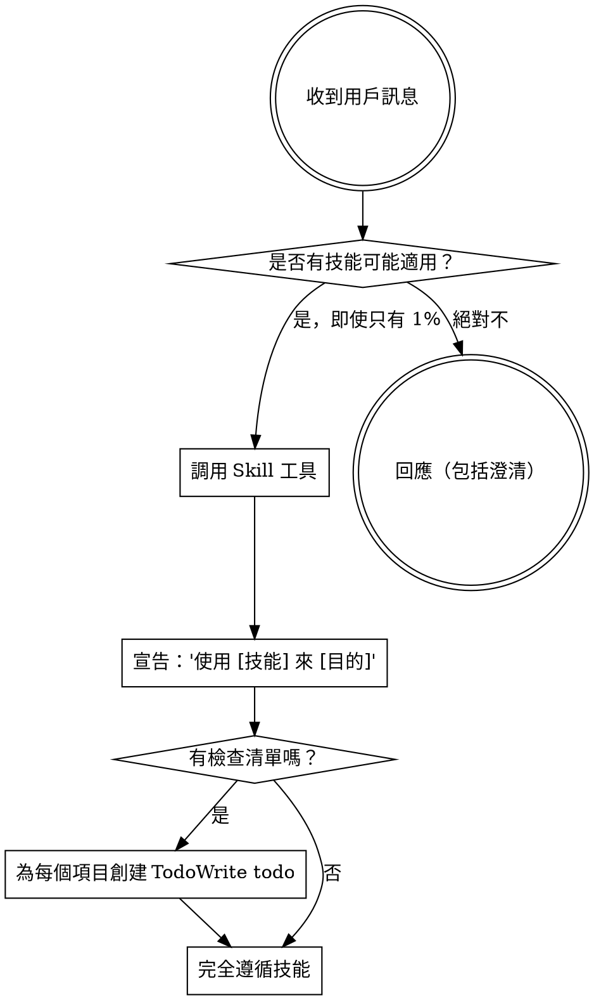

<EXTREMELY-IMPORTANT>
如果您認為有哪怕 1% 的可能性某個技能可能適用於您正在做的事情，您絕對必須調用該技能。

如果某個技能適用於您的任務，您別無選擇。您必須使用它。

這不可協商。這不是可選的。您無法為此找理由開脫。
</EXTREMELY-IMPORTANT>

## 如何訪問技能

**在 Claude Code 中：** 使用 `Skill` 工具。當您調用技能時，其內容會被加載並呈現給您——直接遵循它。絕不要對技能文件使用 Read 工具。

**在其他環境中：** 查看您平台的文檔以了解技能如何加載。

# 使用技能

## 規則

**在任何回應或行動之前調用相關或被請求的技能。** 即使只有 1% 的可能性某個技能可能適用，也意味著您應該調用該技能進行檢查。如果調用的技能結果不適合當前情況，您不需要使用它。

## 紅旗警示

這些想法意味著停止——您正在為自己找理由：

| 想法 | 現實 |
|------|------|
| "這只是一個簡單的問題" | 問題也是任務。檢查技能。 |
| "我需要先獲得更多背景" | 技能檢查在澄清問題之前。 |
| "讓我先探索代碼庫" | 技能告訴您如何探索。先檢查。 |
| "我可以快速檢查 git/文件" | 文件缺乏對話背景。檢查技能。 |
| "讓我先收集信息" | 技能告訴您如何收集信息。 |
| "這不需要正式的技能" | 如果技能存在，就使用它。 |
| "我記得這個技能" | 技能會演變。閱讀當前版本。 |
| "這不算是一個任務" | 行動 = 任務。檢查技能。 |
| "這個技能太過頭了" | 簡單的事情會變複雜。使用它。 |
| "我先做這一件事" | 在做任何事之前先檢查。 |
| "這感覺很有成效" | 無紀律的行動浪費時間。技能防止這種情況。 |
| "我知道那是什麼意思" | 知道概念 ≠ 使用技能。調用它。 |

## 技能優先級

當多個技能可能適用時，使用以下順序：

1. **流程技能優先** (brainstorming、debugging) - 這些決定如何處理任務
2. **實作技能其次** (frontend-design、mcp-builder) - 這些指導執行

「讓我們構建 X」 → 先 brainstorming，然後實作技能。
「修復這個 bug」 → 先 debugging，然後特定領域技能。

## 技能類型

**嚴格型** (TDD、debugging)：完全遵循。不要為了適應而放棄紀律。

**靈活型** (patterns)：根據背景調整原則。

技能本身會告訴您是哪一種。

## 用戶指令

指令說明做什麼，而不是如何做。「添加 X」或「修復 Y」並不意味著跳過工作流程。
