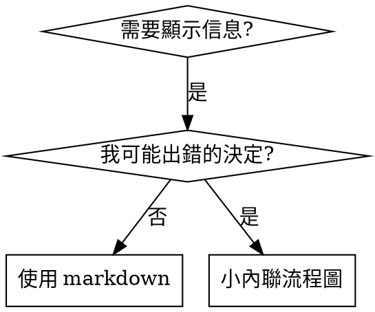

# 編寫技能

## 概述

**編寫技能就是將測試驅動開發應用於流程文檔。**

**個人技能存放在代理特定目錄中(Claude Code 的 `~/.claude/skills`,Codex 的 `~/.codex/skills`)**

您編寫測試案例(使用子代理的壓力情境),觀察它們失敗(基線行為),編寫技能(文檔),觀察測試通過(代理遵守),並重構(關閉漏洞)。

**核心原則:** 如果您沒有觀察到代理在沒有技能的情況下失敗,您就不知道技能是否教對了東西。

**必需背景:** 您必須在使用此技能前理解 superpowers:test-driven-development。該技能定義了基本的 RED-GREEN-REFACTOR 循環。本技能將 TDD 適應到文檔。

**官方指導:** 有關 Anthropic 的官方技能編寫最佳實踐,請參閱 anthropic-best-practices.md。該文檔提供了補充本技能中 TDD 方法的額外模式和指南。

## 什麼是技能?

**技能**是經過驗證的技術、模式或工具的參考指南。技能幫助未來的 Claude 實例找到並應用有效的方法。

**技能是:** 可重用的技術、模式、工具、參考指南

**技能不是:** 關於您曾經如何解決問題的敘述

## TDD 映射到技能

| TDD 概念 | 技能創建 |
|---------|---------|
| **測試案例** | 使用子代理的壓力情境 |
| **生產代碼** | 技能文檔(SKILL.md) |
| **測試失敗(RED)** | 代理在沒有技能的情況下違反規則(基線) |
| **測試通過(GREEN)** | 代理在有技能的情況下遵守 |
| **重構** | 在保持遵守的同時關閉漏洞 |
| **先寫測試** | 在編寫技能前運行基線情境 |
| **觀察失敗** | 記錄代理使用的確切藉口 |
| **最小代碼** | 編寫解決這些特定違規的技能 |
| **觀察通過** | 驗證代理現在遵守 |
| **重構循環** | 找到新藉口 → 堵住 → 重新驗證 |

整個技能創建過程遵循 RED-GREEN-REFACTOR。

## 何時創建技能

**創建當:**
- 技術對您來說不是直觀明顯的
- 您會跨專案再次參考這個
- 模式廣泛適用(非專案特定)
- 其他人會受益

**不要創建於:**
- 一次性解決方案
- 在其他地方有詳細文檔的標準實踐
- 專案特定慣例(放在 CLAUDE.md 中)
- 機械約束(如果可以用正則表達式/驗證強制執行,自動化它—將文檔保存給判斷調用)

## 技能類型

### 技術
具有要遵循步驟的具體方法(condition-based-waiting、root-cause-tracing)

### 模式
思考問題的方式(flatten-with-flags、test-invariants)

### 參考
API 文檔、語法指南、工具文檔(office docs)

## 目錄結構


```
skills/
  skill-name/
    SKILL.md              # 主參考(必需)
    supporting-file.*     # 僅在需要時
```

**扁平命名空間** - 所有技能在一個可搜索的命名空間中

**分離文件用於:**
1. **重量級參考**(100+ 行) - API 文檔、全面語法
2. **可重用工具** - 腳本、實用程序、模板

**保持內聯:**
- 原則和概念
- 代碼模式(< 50 行)
- 其他所有內容

## SKILL.md 結構

**Frontmatter (YAML):**
- 僅支持兩個欄位: `name` 和 `description`
- 總共最多 1024 字符
- `name`: 僅使用字母、數字和連字符(無括號、特殊字符)
- `description`: 第三人稱,僅描述何時使用(不是它做什麼)
  - 以「當...時使用」開頭,專注於觸發條件
  - 包括特定症狀、情況和背景
  - **絕不總結技能的流程或工作流程**(見 CSO 部分了解原因)
  - 盡可能保持在 500 字符以下

```markdown
---
name: Skill-Name-With-Hyphens
description: 當 [特定觸發條件和症狀] 時使用
---

# 技能名稱

## 概述
這是什麼? 核心原則用 1-2 句話。

## 何時使用
[如果決定不明顯則使用小型內聯流程圖]

帶有症狀和用例的項目列表
何時不使用

## 核心模式(用於技術/模式)
前後代碼比較

## 快速參考
用於掃描常見操作的表格或項目符號

## 實作
簡單模式的內聯代碼
重量級參考或可重用工具的文件連結

## 常見錯誤
什麼出錯 + 修復

## 真實世界影響(可選)
具體結果
```


## Claude 搜索優化(CSO)

**對發現至關重要:** 未來的 Claude 需要找到您的技能

### 1. 豐富的描述欄位

**目的:** Claude 讀取描述來決定為給定任務加載哪些技能。讓它回答:「我現在應該閱讀這個技能嗎?」

**格式:** 以「當...時使用」開頭,專注於觸發條件

**關鍵: 描述 = 何時使用,而不是技能做什麼**

描述應該僅描述觸發條件。不要在描述中總結技能的流程或工作流程。

**為什麼這很重要:** 測試顯示,當描述總結技能的工作流程時,Claude 可能會遵循描述而不是閱讀完整的技能內容。一個說「任務之間的代碼審查」的描述導致 Claude 進行一次審查,即使技能的流程圖清楚地顯示了兩次審查(規格遵守然後代碼質量)。

當描述更改為僅「當執行具有獨立任務的實作計劃時使用」(無工作流程摘要)時,Claude 正確閱讀了流程圖並遵循了兩階段審查流程。

**陷阱:** 總結工作流程的描述會創建 Claude 將採取的捷徑。技能主體變成 Claude 跳過的文檔。

```yaml
# ❌ BAD: 總結工作流程 - Claude 可能遵循此描述而不是閱讀技能
description: 當執行計劃時使用 - 為每個任務分派子代理,任務之間進行代碼審查

# ❌ BAD: 過多流程詳細信息
description: 當使用 TDD 時使用 - 先寫測試,觀察其失敗,編寫最小代碼,重構

# ✅ GOOD: 僅觸發條件,無工作流程摘要
description: 當在當前會話中執行具有獨立任務的實作計劃時使用

# ✅ GOOD: 僅觸發條件
description: 當實作任何功能或錯誤修正時使用,編寫實作代碼前
```

**內容:**
- 使用具體的觸發條件、症狀和情況來表示此技能適用
- 描述*問題*(競態條件、不一致的行為)而不是*語言特定的症狀*(setTimeout、sleep)
- 保持觸發條件不受技術限制,除非技能本身是技術特定的
- 如果技能是技術特定的,在觸發條件中明確說明
- 用第三人稱編寫(注入到系統提示中)
- **絕不總結技能的流程或工作流程**

```yaml
# ❌ BAD: 過於抽象、模糊,不包含何時使用
description: 用於非同步測試

# ❌ BAD: 第一人稱
description: 當非同步測試出現問題時我可以幫助您

# ❌ BAD: 提及技術但技能並非特定於此技術
description: 當測試使用 setTimeout/sleep 且不穩定時使用

# ✅ GOOD: 以「何時使用」開頭,描述問題,無工作流程
description: 當測試存在競態條件、時序依賴或通過/失敗不一致時使用

# ✅ GOOD: 技術特定技能,含明確觸發條件
description: 當使用 React Router 並處理身份驗證重定向時使用
```

### 2. 關鍵詞覆蓋

使用 Claude 會搜索的詞語:
- 錯誤訊息: 「Hook timed out」、「ENOTEMPTY」、「race condition」
- 症狀: 「flaky」、「hanging」、「zombie」、「pollution」
- 同義詞: 「timeout/hang/freeze」、「cleanup/teardown/afterEach」
- 工具: 實際命令、函式庫名稱、文件類型

### 3. 描述性命名

**使用主動語態、動詞優先:**
- ✅ `creating-skills` 而不是 `skill-creation`
- ✅ `condition-based-waiting` 而不是 `async-test-helpers`

### 4. Token 效率(關鍵)

**問題:** getting-started 和頻繁參考的技能會加載到每個對話中。每個 token 都很重要。

**目標字數:**
- getting-started 工作流程: <150 字
- 頻繁加載的技能: <200 字總計
- 其他技能: <500 字(仍要簡潔)

**技術:**

**將詳細信息移動到工具幫助:**
```bash
# ❌ BAD: 在 SKILL.md 中記錄所有標誌
search-conversations 支持 --text、--both、--after DATE、--before DATE、--limit N

# ✅ GOOD: 參考 --help
search-conversations 支持多種模式和篩選器。執行 --help 查看詳細信息。
```

**使用交叉參考:**
```markdown
# ❌ BAD: 重複工作流程詳細信息
搜索時,使用模板分派子代理...
[20 行重複的說明]

# ✅ GOOD: 參考其他技能
總是使用子代理(50-100 倍上下文節省)。必需: 使用 [other-skill-name] 進行工作流程。
```

**壓縮示例:**
```markdown
# ❌ BAD: 冗長示例(42 字)
您的人類夥伴: 「我們之前如何在 React Router 中處理身份驗證錯誤?」
您: 我將搜索過去的對話,查找 React Router 身份驗證模式。
[分派子代理,搜索查詢: 「React Router 身份驗證錯誤處理 401」]

# ✅ GOOD: 最少示例(20 字)
夥伴: 「我們之前如何在 React Router 中處理身份驗證錯誤?」
您: 搜索中...
[分派子代理 → 綜合]
```

**消除冗餘:**
- 不要重複交叉參考技能中的內容
- 不要解釋命令中明顯的內容
- 不要包含同一模式的多個示例

**驗證:**
```bash
wc -w skills/path/SKILL.md
# getting-started 工作流程: 目標 <150 字
# 其他頻繁加載: 目標 <200 字總計
```

**按您做什麼或核心洞察命名:**
- ✅ `condition-based-waiting` > `async-test-helpers`
- ✅ `using-skills` 而不是 `skill-usage`
- ✅ `flatten-with-flags` > `data-structure-refactoring`
- ✅ `root-cause-tracing` > `debugging-techniques`

**動名詞(-ing)適用於流程:**
- `creating-skills`、`testing-skills`、`debugging-with-logs`
- 主動,描述您正在採取的行動

### 4. 交叉參考其他技能

**編寫參考其他技能的文檔時:**

僅使用技能名稱,帶有明確的要求標記:
- ✅ 好: `**必需子技能:** 使用 superpowers:test-driven-development`
- ✅ 好: `**必需背景:** 您必須理解 superpowers:systematic-debugging`
- ❌ 不好: `查看 skills/testing/test-driven-development`(不清楚是否必需)
- ❌ 不好: `@skills/testing/test-driven-development/SKILL.md`(強制加載,燒錄上下文)

**為什麼沒有 @ 鏈接:** `@` 語法立即強制加載文件,在您需要前消耗 200k+ 上下文。

## 流程圖使用



**僅在以下情況使用流程圖:**
- 非明顯的決定點
- 您可能過早停止的流程循環
- 「何時使用 A 而不是 B」決定

**絕不為以下情況使用流程圖:**
- 參考資料 → 表格、列表
- 代碼示例 → Markdown 塊
- 線性說明 → 編號列表
- 沒有語義含義的標籤(step1、helper2)

有關 graphviz 樣式規則,請參閱 @graphviz-conventions.dot。

**為您的人類夥伴可視化:** 使用此目錄中的 `render-graphs.js` 將技能的流程圖渲染為 SVG:
```bash
./render-graphs.js ../some-skill           # 分別每個圖
./render-graphs.js ../some-skill --combine # 全部圖在一個 SVG
```

## 代碼示例

**一個優秀示例勝過許多平庸的示例**

選擇最相關的語言:
- 測試技術 → TypeScript/JavaScript
- 系統調試 → Shell/Python
- 數據處理 → Python

**好示例:**
- 完整且可運行
- 註釋清楚解釋為什麼
- 來自真實場景
- 清晰展示模式
- 準備好適應(不是通用模板)

**不要:**
- 以 5+ 種語言實作
- 創建填空模板
- 編寫虛構示例

您擅長移植 - 一個優秀示例就足夠了。

## 文件組織

### 自包含技能
```
defense-in-depth/
  SKILL.md    # 全部內聯
```
何時: 所有內容都適合,無需大量參考

### 具有可重用工具的技能
```
condition-based-waiting/
  SKILL.md    # 概述 + 模式
  example.ts  # 可適應的工作幫助程序
```
何時: 工具是可重用代碼,不只是敘述

### 具有大量參考資料的技能
```
pptx/
  SKILL.md       # 概述 + 工作流程
  pptxgenjs.md   # 600 行 API 參考
  ooxml.md       # 500 行 XML 結構
  scripts/       # 可執行工具
```
何時: 參考資料太大無法內聯

## 鐵律(與 TDD 相同)

```
沒有失敗測試絕不編寫技能
```

這適用於新技能和現有技能的編輯。

先編寫技能後測試?刪除它。重新開始。
編輯技能而不測試?相同違規。

**沒有例外:**
- 不適用於「簡單添加」
- 不適用於「只是添加一個部分」
- 不適用於「文檔更新」
- 不要將未測試的更改保留為「參考」
- 不要在運行測試時「適應」
- 刪除意味著刪除

**必需背景:** superpowers:test-driven-development 技能解釋為什麼這很重要。同樣的原則適用於文檔。

## 測試所有技能類型

不同的技能類型需要不同的測試方法:

### 紀律執行技能(規則/要求)

**示例:** TDD、verification-before-completion、designing-before-coding

**測試方法:**
- 學術問題: 他們理解規則嗎?
- 壓力情景: 他們在壓力下遵守嗎?
- 多重壓力結合: 時間 + 沉沒成本 + 疲勞
- 識別合理化並添加明確計數器

**成功標準:** 代理在最大壓力下遵守規則

### 技術技能(操作指南)

**示例:** condition-based-waiting、root-cause-tracing、defensive-programming

**測試方法:**
- 應用場景: 他們能正確應用技術嗎?
- 變化場景: 他們處理邊界情況嗎?
- 缺少信息測試: 說明中有漏洞嗎?

**成功標準:** 代理成功將技術應用於新場景

### 模式技能(心智模型)

**示例:** reducing-complexity、information-hiding 概念

**測試方法:**
- 識別場景: 他們識別何時應用模式嗎?
- 應用場景: 他們能使用心智模型嗎?
- 反例: 他們知道何時不適用嗎?

**成功標準:** 代理正確識別何時/如何應用模式

### 參考技能(文檔/API)

**示例:** API 文檔、命令參考、函式庫指南

**測試方法:**
- 檢索場景: 他們能找到正確信息嗎?
- 應用場景: 他們能正確使用所找到的信息嗎?
- 漏洞測試: 常見用例是否涵蓋?

**成功標準:** 代理找到並正確應用參考信息

## 跳過測試的常見合理化

| 藉口 | 現實 |
|--------|---------|
| 「技能顯然清晰」 | 對您清晰 ≠ 對其他代理清晰。測試它。 |
| 「只是一個參考」 | 參考可能有漏洞、不清楚的部分。測試檢索。 |
| 「測試是過度的」 | 未測試的技能有問題。總是。15 分鐘測試省幾小時。 |
| 「如果出現問題我會測試」 | 問題 = 代理無法使用技能。在部署前測試。 |
| 「太繁瑣無法測試」 | 測試不如在生產中調試壞技能繁瑣。 |
| 「我有信心它是好的」 | 過度自信保證問題。測試它。 |
| 「學術審查就夠了」 | 閱讀 ≠ 使用。測試應用場景。 |
| 「沒有時間測試」 | 部署未測試的技能浪費更多時間修復它。 |

**所有這些都意味著: 在部署前測試。沒有例外。**

## 防彈化技能以抵抗合理化

執行紀律的技能(如 TDD)需要抵抗合理化。當代理在壓力下時,它們很聰明並會找到漏洞。

**心理學說明:** 理解說服技術為什麼有效可以幫助您系統地應用它們。有關權威、承諾、稀缺性、社會證明和統一原則的研究基礎(Cialdini, 2021; Meincke et al., 2025),請參閱 persuasion-principles.md。

### 明確關閉每個漏洞

不要只是陳述規則 - 禁止具體的變通方法:

<Bad>
```markdown
先編寫代碼後測試?刪除它。
```
</Bad>

<Good>
```markdown
先編寫代碼後測試?刪除它。重新開始。

**沒有例外:**
- 不要將其保留為「參考」
- 在編寫測試時不要「適應」它
- 不要查看它
- 刪除意味著刪除
```
</Good>

### 解決「精神 vs 字面」論證

盡早添加基礎原則:

```markdown
**違反規則的字面含義就是違反規則的精神。**
```

這切斷了整個「我遵循精神」合理化類別。

### 構建合理化表

從基線測試中捕獲合理化(見下面測試部分)。代理提出的每個藉口都進入表中:

```markdown
| 藉口 | 現實 |
|--------|---------|
| 「太簡單無法測試」 | 簡單代碼會崩潰。測試花 30 秒。 |
| 「我稍後會測試」 | 測試立即通過並不能證明任何東西。 |
| 「之後測試達到相同目標」 | 之後測試 = 「這是什麼?」 先測試 = 「這應該是什麼?」 |
```

### 創建紅旗列表

讓代理在合理化時容易自檢:

```markdown
## 紅旗 - 停止並重新開始

- 代碼先於測試
- 「我已經手動測試過了」
- 「之後的測試達到相同目的」
- 「這是關於精神而不是儀式」
- 「這是不同的,因為...」

**所有這些都意味著: 刪除代碼。使用 TDD 重新開始。**
```

### 為違規症狀更新 CSO

添加到描述中: 您即將違反規則時的症狀:

```yaml
description: 當實作任何功能或錯誤修正時使用,編寫實作代碼前
```

## 技能的 RED-GREEN-REFACTOR

遵循 TDD 循環:

### RED: 編寫失敗測試(基線)

運行壓力情景與子代理,不使用技能。記錄確切的行為:
- 他們做了什麼選擇?
- 他們使用了什麼合理化(逐字)?
- 哪些壓力觸發了違規?

這是「觀察測試失敗」- 您必須看到代理在編寫技能前自然做什麼。

### GREEN: 編寫最小技能

編寫解決這些特定合理化的技能。不要為假設情況添加額外內容。

運行相同場景,使用技能。代理現在應該遵守。

### REFACTOR: 關閉漏洞

代理發現新的合理化?添加明確計數器。重新測試直到防彈。

**測試方法:** 查看 @testing-skills-with-subagents.md 了解完整測試方法:
- 如何編寫壓力情景
- 壓力類型(時間、沉沒成本、權威、疲勞)
- 系統地堵住漏洞
- 元測試技術

## 反模式

### ❌ 敘述示例
「在 2025-10-03 會話中,我們發現空的 projectDir 引起...」
**為什麼不好:** 太具體,不可重用

### ❌ 多語言稀釋
example-js.js、example-py.py、example-go.go
**為什麼不好:** 質量平庸,維護負擔

### ❌ 流程圖中的代碼
```dot
step1 [label="import fs"];
step2 [label="read file"];
```
**為什麼不好:** 無法複製粘貼,難以閱讀

### ❌ 通用標籤
helper1、helper2、step3、pattern4
**為什麼不好:** 標籤應該有語義含義

## 停止: 在移動到下一個技能之前

**編寫任何技能後,您必須停止並完成部署流程。**

**不要:**
- 在不測試每個的情況下批量創建多個技能
- 在驗證當前技能之前移動到下一個技能
- 跳過測試,因為「批處理更有效率」

**下面的部署檢查清單對每個技能都是強制性的。**

部署未測試的技能 = 部署未測試的代碼。這是違反質量標準。

## 技能創建檢查清單(TDD 適應)

**重要: 使用 TodoWrite 為下面每個檢查清單項創建待辦事項。**

**RED 階段 - 編寫失敗測試:**
- [ ] 創建壓力情景(紀律技能 3+ 組合壓力)
- [ ] 運行情景不使用技能 - 逐字記錄基線行為
- [ ] 識別合理化/失敗中的模式

**GREEN 階段 - 編寫最小技能:**
- [ ] 名稱僅使用字母、數字、連字符(無括號/特殊字符)
- [ ] YAML frontmatter 僅包含名稱和描述(最多 1024 字符)
- [ ] 描述以「何時使用」開頭並包括具體觸發條件/症狀
- [ ] 描述用第三人稱編寫
- [ ] 全文搜索關鍵詞(錯誤、症狀、工具)
- [ ] 明確概述與核心原則
- [ ] 解決 RED 中確定的具體基線失敗
- [ ] 代碼內聯或鏈接到單獨文件
- [ ] 一個優秀示例(不是多語言)
- [ ] 運行情景使用技能 - 驗證代理現在遵守

**REFACTOR 階段 - 關閉漏洞:**
- [ ] 識別測試中的新合理化
- [ ] 添加明確計數器(如果紀律技能)
- [ ] 從所有測試迭代構建合理化表
- [ ] 創建紅旗列表
- [ ] 重新測試直到防彈

**質量檢查:**
- [ ] 小流程圖僅在決定非明顯時使用
- [ ] 快速參考表
- [ ] 常見錯誤部分
- [ ] 無敘述故事講述
- [ ] 支持文件僅用於工具或大量參考

**部署:**
- [ ] 提交技能到 git 並推送到您的分叉(如果配置)
- [ ] 考慮通過 PR 貢獻回去(如果廣泛適用)

## 發現工作流程

未來的 Claude 如何找到您的技能:

1. **遇到問題**(「測試不穩定」)
3. **找到技能**(描述匹配)
4. **掃描概述**(這相關嗎?)
5. **讀取模式**(快速參考表)
6. **加載示例**(僅在實作時)

**為此流程優化** - 盡早且經常放置可搜索術語。

## 底線

**創建技能就是流程文檔的 TDD。**

相同的鐵律: 沒有失敗測試絕不編寫技能。
相同的循環: RED(基線)→ GREEN(編寫技能)→ REFACTOR(關閉漏洞)。
相同的好處: 更好的質量、更少的驚喜、防彈結果。

如果您對代碼遵循 TDD,也遵循它用於技能。這是應用於文檔的相同紀律。
